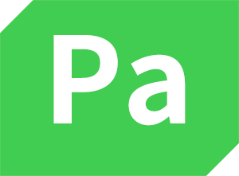

## PyQt5 Apps

A set of special tools to cope with **my daily tasks**. It's based on [Python 3.6+](https://www.python.org) and [PyQt5](https://riverbankcomputing.com/software/pyqt/download5), licensed under the [GPL v3](LICENSE).

All image resources in this repo are from [iconfont](http://www.iconfont.cn).

### Table of Contents
|           :squirrel:           |      :jack_o_lantern:          |            :beer:              |            :fish_cake:         |            :octocat:            |
| ------------------------------ | ------------------------------ | -------------------------------| ------------------------------ | ------------------------------- |
| [Google Translate](#google-translate) | [Bilibili Kit](#bilibili-kit) | [Words Recorder](#words-recorder) | [HUST Electricity Fee](#hust-electricity-fee) | [Missevan Kit](#missevan-kit) |
| [Lossless Music Box](#lossless-music-box) | [HUST Lib](#hust-lib) | [WordCloud Generator](#wordcloud-generator) | [Cat Calendar](#cat-calendar) | [FFmpeg Helper](#ffmpeg-helper)  |
| [Pangu](#pangu) |  | | | |

### Google Translate
[Google Translate](google-translate) is a translation app using [Google translate api](https://github.com/ssut/py-googletrans).

    

### Bilibili Kit

[Bilibili Kit](bilibili-kit) is an app to download video, cover and  'bullet screen' from [bilibili](https://www.bilibili.com/). 

maybe you can try [this one](https://github.com/LewisTian/bili-box) :flags:

    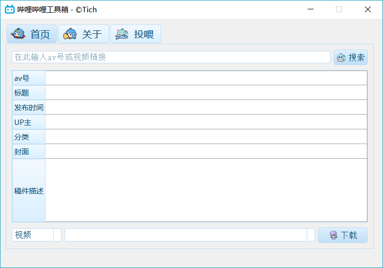

### Words Recorder

[Words Recorder](words-recorder) is an app to record the word that you are unfamiliar with when you do some reading, based on Python, PyQt5 and MySQL. 

    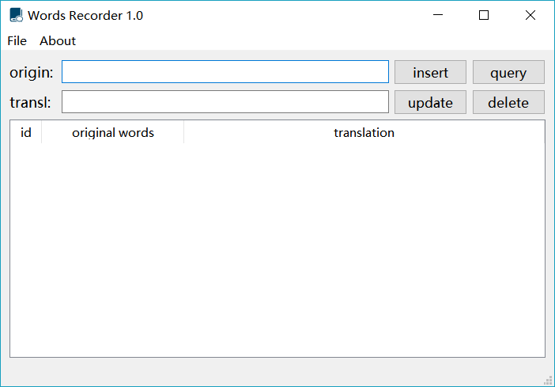

### HUST Electricity Fee

[HUST Electricity Fee](hust-electricity-fee) is an app to query [HUST](http://www.hust.edu.cn/) student dormitory electricity fee from [科大中天电量查询系统](http://202.114.18.218/Main.aspx). 

    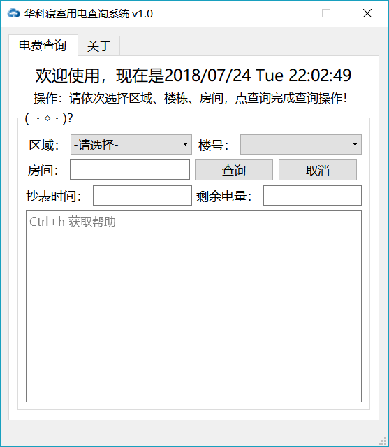

### Missevan Kit

[Missevan Kit](missevan-kit) is an app to download user's sounds from [missevan.com](http://www.missevan/). 

    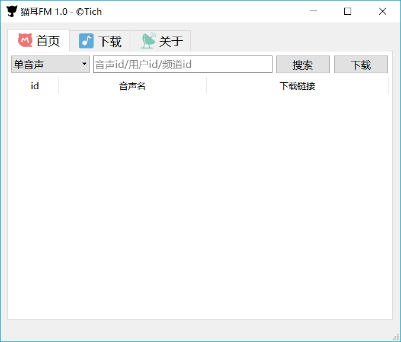

### Lossless Music Box

[Lossless Music Box](lossless-music-box) is an app to download Lossless Music.

    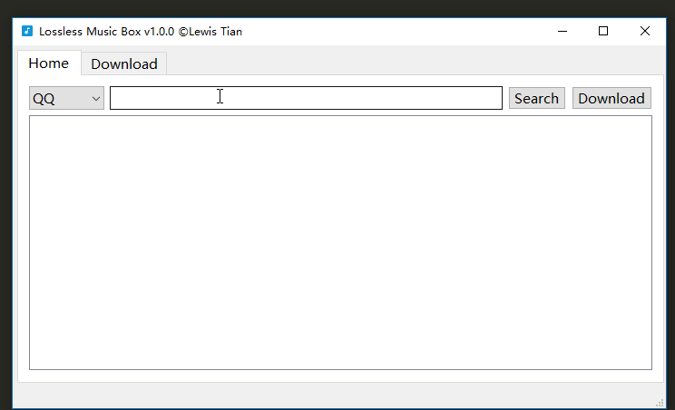

### HUST Lib

[HUST Lib](hust-lib) is an app to query hust library collection information.

    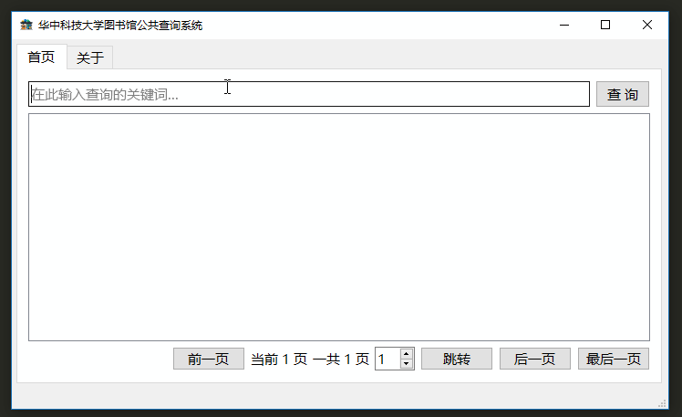

### WordCloud Generator

[WordCloud Generator](word-cloud-generator) is an app to generate WordCloud images.

    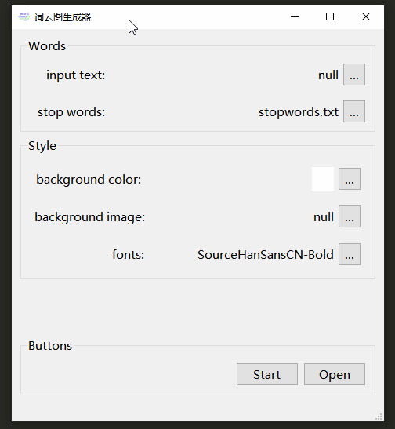

### Cat Calendar

A simple [Cat Calendar](cat-calendar) image generator that uses the "www.dutangapp.cn" and "wufazhuce.com" api.

    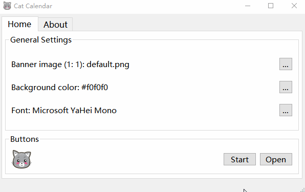

### FFmpeg Helper

[FFmpeg Helper](ffmpeg-helper) is a FFmpeg-based tool to cut/merge video, extract audio from the video and merge video & audio to new video.

    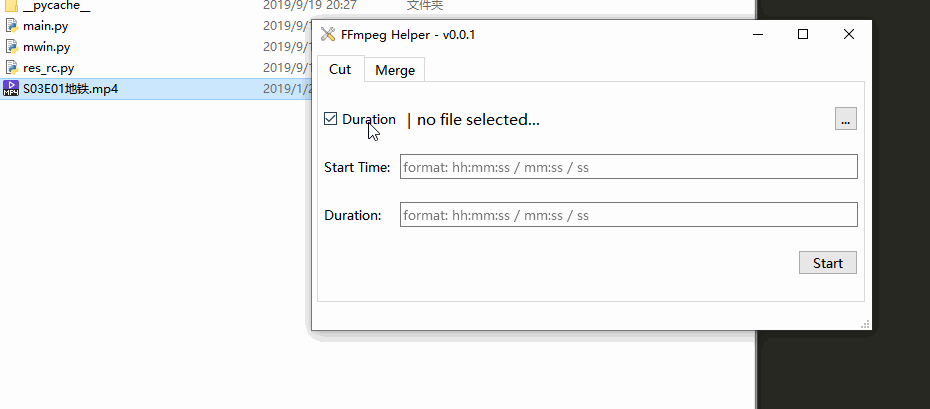

### Pangu

[Pangu](pangu): can't you add spaces?

    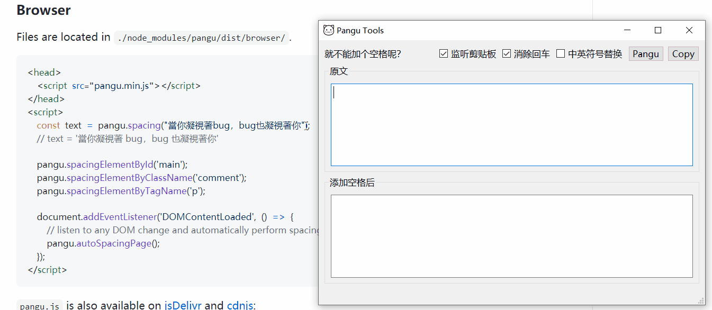

### Donation
If you think these apps are useful, you can buy me a cup of coffee :P

	
	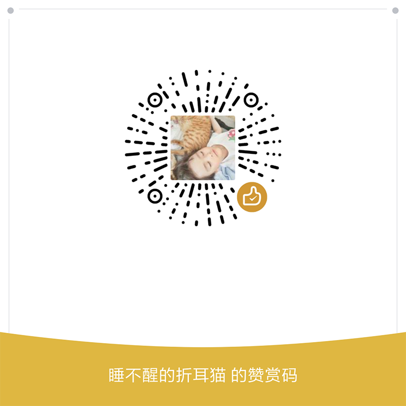

### Thanks list
Thanks a lot for your generosity :3

|  name                | date        | money  | Q/msg  | A/reply|
|  ----                | ----        | ----   | ----   |----    |
| M*a/W                | 2020/03/23  | 5       |学生党，送一个可爱多 | |
| David Cheung张晓翔/W | 2019/12/26  | 50      | | |
| *井学/A              | 2019/12/14  | 20      |请教一下 style.qss 要怎样写？ | 我看来其实是跟 css 是差不多的，具体可以参考 [官网文档](https://doc.qt.io/qt-5/stylesheet-examples.html)，另外有问题可以提 [issue](https://github.com/taseikyo/PyQt5-Apps/issues) 啊 :3 |
| *艾周/A              | 2019/04/08  | 10      | | |
| *生/W                | 2018/08/02  | 1       |亿圆 四舍五入就是。 | |

### LICENSE
Copyright (c) 2018 Lewis Tian. Licensed under the MIT license.