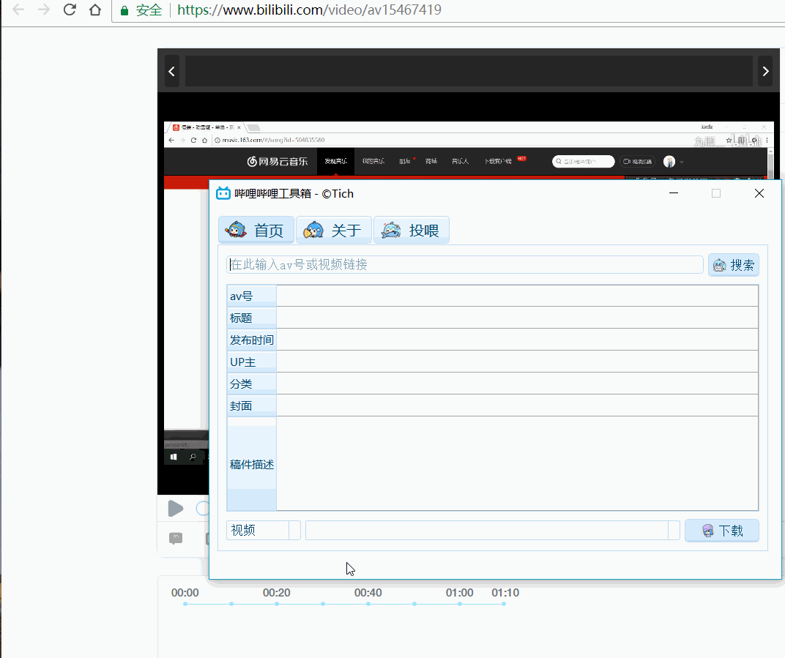

## 哔哩哔哩工具箱
主要功能是下载 [bilibili(B 站)](https://www.bilibili.com/) 视频、弹幕和封面

## 声明
> 本项目所有图片内容均由 *bilibili* 提供, 获取与共享之行为或有侵犯 *bilibili* 权益的嫌疑, 若被告知需停止共享与使用, 本人会及时删除整个项目. 请您了解相关情况, 并遵守 *bilibili* 协议。

### 截图

    

### 背景
在看到有趣的 B 站视频的时候，就想着下载下来看。之前有 jijidown 那个软件可以使用，后来好像出了什么问题（反正在我的电脑上不能用），最后无奈只能自己想办法，参考了知乎上的一个回答，然后自己研究了一下，最后用 PyQt 写了一个小应用，用来下载视频、弹幕和封面。

话说配合 [BiliLocal](https://github.com/AncientLysine/BiliLocal) 食用效果更佳。

### 修改
#### v1.1
因为 1.0 存在一些问题，比如视频只下载了第一个分片，还不能下载多 p 的视频，于是这几天就改了一下。

结果改了好几天累死了，还是太菜了吧。想把表格行数和多线程关联起来，开始想每下载完一个视频，对应的表格行就删除，结果会导致一些问题，应该就是多线程同步问题。

我用一个名为 `row2qthread` 的字典存这样一个对应关系，每删除一个行，则该行后面的行要减一（由于表格行数减少了一个），但是实际做的时候出现了一些问题就暂时不管了。直接把下载完成的行留下，这样就简单多了。

还有一个问题是视频合并，因为有些视频有多分片，最多见过 20 多个分片的，但是暂时不会，就先放一边吧。

### 演示
输入视频链接或者视频 id ，点击搜索或者快捷键 `Ctrl + Enter`，下载快捷键 `Ctrl + L`

    

### 下载使用
[点我下载](https://github.com/LewisTian/PyQt5-Apps/releases)

### License
GNU General Public License v3.0 License
