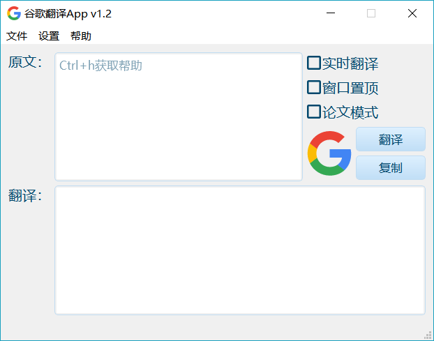
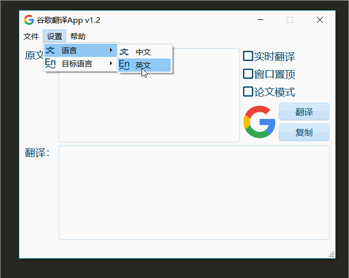
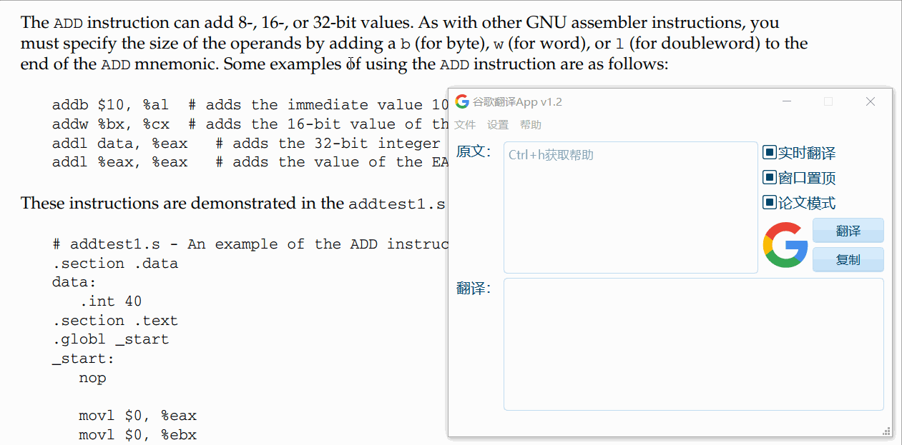
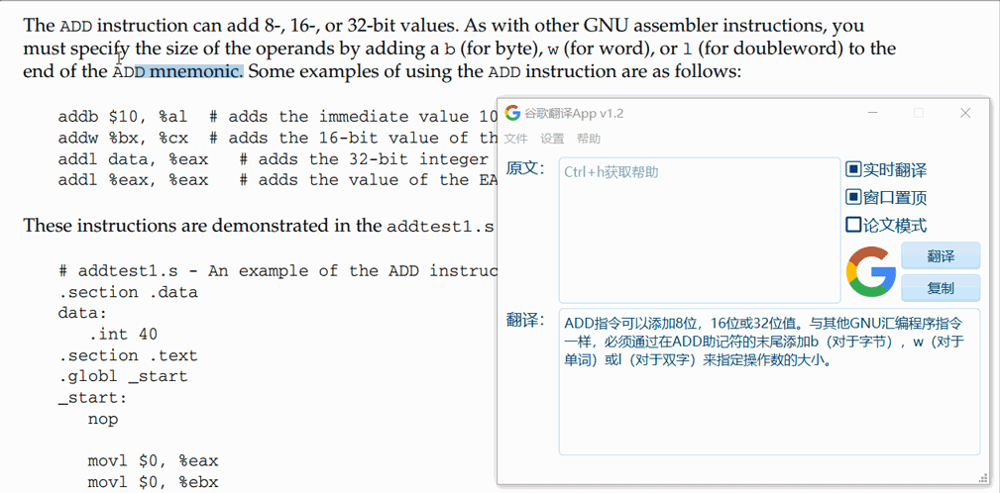

## Google Translate
Google Translate is a translation app using [Google translate api](https://github.com/ssut/py-googletrans).

### Screenshot
<div align="center">
    
    
</div>

### Background
When I read papers, I used [Google Translate](https://translate.google.cn) to translate the words and sentences that I could not understand. But every time I had to use shortcuts Ctrl+C, Ctrl+V. Moreover when copying sentences from a PDF, it will bring a additional enter and a strange symbol sometimes. It is very annoying. Then I wondered why I could't develop a app to use the Google Translate API to translate them directly. I viewed the Google Translate project on GitHub and found an [interesting repo](https://github.com/ssut/py-googletrans).

### Feature
1. Enter the translation manually. Enter the English you want to translate in the 'original' input field, then click the `translate` button, or use the shortcut Ctrl+Enter
2. paper model. To use the paper mode, you need to check the real-time translation. My real-time translation here is to monitor the clipboard, then translate the copied text into Chinese, and automatically replace the additional enter and multiple spaces with a space in the paper mode, and remove one special symbol ``
3. window top. Checking this box will cause the window to remain at the top of all applications.

### replace rules
until today (19/05/18)
```
 -> 
€ -> fi
 -> ffi
‚ -> ff
ƒ -> fl
‡ -> ft
‰ -> ft
Š -> tt
Π-> th
```

### Preview
1. regular mode
<div align="center">
    
</div>

2. paper mode
<div align="center">
    
</div>

3. non paper mode
<div align="center">
    
</div>

### Installation
```
>> git clone https://github.com/LewisTian/GoogleTranslateApp.git
>> cd GoogleTranslateApp
>> pip install -r requirement.txt
>> python main.py
```

### Package
```
>> git clone https://github.com/pyinstaller/pyinstaller.git
>> cd pyinstaller
>> python setup.py install
>> pyinstaller -F -w main.py -p mwin.py -p res_rc.py -i google.ico
```

### Download
[click me to download](https://github.com/LewisTian/PyQt5-Apps/releases)

### References
- https://github.com/ssut/py-googletrans
-  https://blog.csdn.net/killua_hzl/article/details/5288769

### License
GNU General Public License v3.0 License
