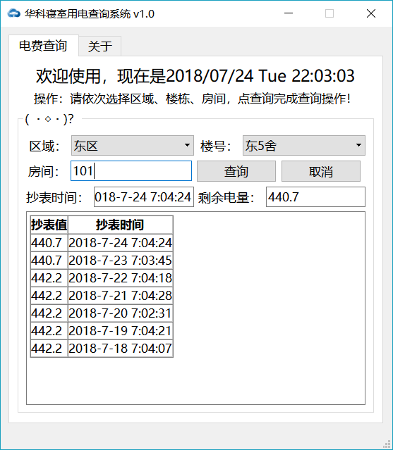
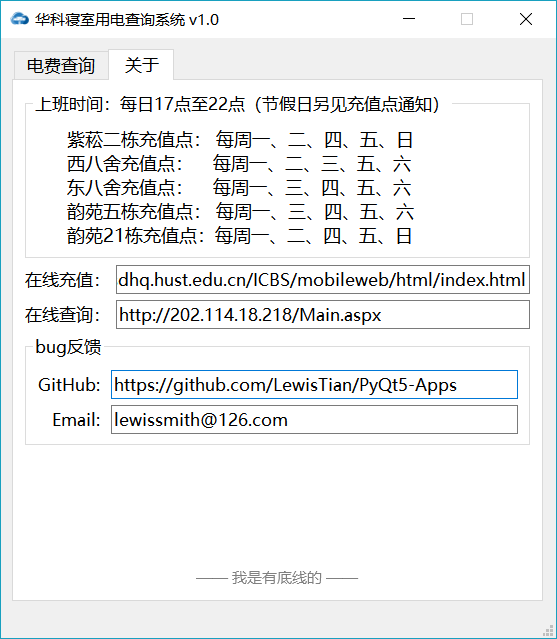

## HUST Electricity Fee
HUST Electricity Fee is an app to query [HUST](http://www.hust.edu.cn/) student dormitory electricity fee. 

### Screenshot
<div align="center">
    
</div>

### Usage
select the dorm area, building number and input your room number, then click `查询` button or use shortcut `Ctrl + Return`.

<div align="center">
    
</div>

about interface.

<div align="center">
    
</div>

### Installation
clone the repo and install the required packages.
```
>> git clone https://github.com/LewisTian/PyQt5-Apps.git
>> cd PyQt5-Apps/hust-electricity-fee
>> pip install -r requirements.txt
```
or just [download the app](https://github.com/LewisTian/PyQt5-Apps/releases) to use.

### Link
data from [科大中天电量查询系统](http://202.114.18.218/Main.aspx).
