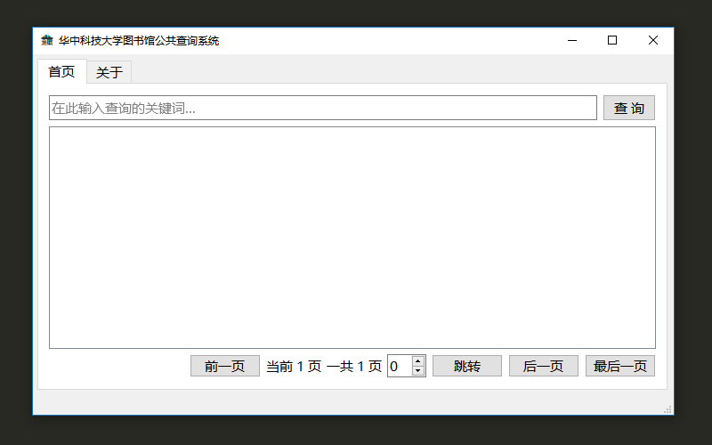

## hust-lib
华科图书馆: 华中科技大学图书馆公共查询系统。

用来查询华科馆藏的一个应用。

    

### KeyBindings
双击进行查询。

Key Binding                                | Description
-------------------------------------------|---------------------------------------------------------
<kbd>Enter</kbd>                           | 搜索
<kbd>Ctrl + N</kbd>                        | 后一页
<kbd>Ctrl + Shift + E</kbd>                | 最后一页
<kbd>Ctrl + B</kbd>                        | 前一页
<kbd>Ctrl + ENTER</kbd>                    | 跳转

### LICENSE
Copyright (c) 2019 Lewis Tian. Licensed under the GNU General Public License v3.0.